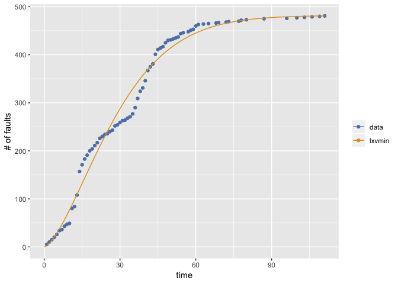
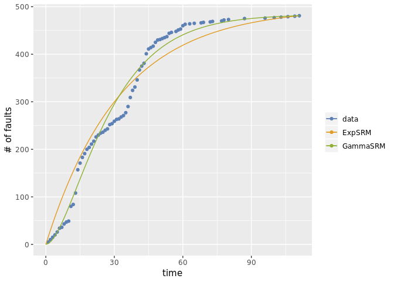

<!-- README.md is generated from README.Rmd. Please edit that file -->
Rsrat
=====

Rsrat provides the package to evalute the software reliability from the fault data collected in the testing phase. Rsrat can use two types of data; fault-detection time data and its grouped data. The fault-detection time data is a sequence of time intervals of fault detection times (CPU time, etc). Also its grouped data is a sequence of the number of detected faults for each time interval (per a working day, per a week, etc). The reliability evaluation is based on the software reliability growth model with NHPP (non-homogeneous Poisson process).

Installation
------------

You can install Rsrat from github with:

``` r
# install.packages("devtools")
devtools::install_github("okamumu/Rsrat")
```

Example
-------

This is an example of the estimation of software reliability growth models from a fault data (tohma).

``` r
### load library
library(Rsrat)

### load example data
data(dacs)

### tohma is a grouped data
tohma
#>   [1]  5  5  5  5  6  8  2  7  4  2 31  4 24 49 14 12  8  9  4  7  6  9  4
#>  [24]  4  2  4  3  9  2  5  4  1  4  3  6 13 19 15  7 15 21  8  6 20 10  3
#>  [47]  3  8  5  1  2  2  2  7  2  0  2  3  2  7  3  0  1  0  1  0  0  1  1
#>  [70]  0  0  1  1  0  0  0  1  2  0  1  0  0  0  0  0  0  2  0  0  0  0  0
#>  [93]  0  0  0  1  0  0  0  1  0  0  1  0  0  1  0  0  1  0  1

### Esimate all models and select the best one in terms of AIC
result <- fit.srm.nhpp(fault=tohma)

### Draw the graph 
mvfplot(fault=tohma, mvf=list(result$srm))
```



The second example illustrates the estimation for two specified models.

``` r
### All models in the package
srm.models
#>  [1] "exp"    "gamma"  "pareto" "tnorm"  "lnorm"  "tlogis" "llogis"
#>  [8] "txvmax" "lxvmax" "txvmin" "lxvmin"

### Estimate two models and no select
result <- fit.srm.nhpp(fault=tohma, srm.names=c("exp", "gamma"), selection=NULL)

### Draw the graph
mvfplot(fault=tohma, mvf=lapply(result, function(m) m$srm))
```


