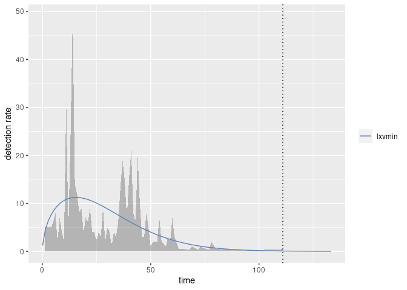
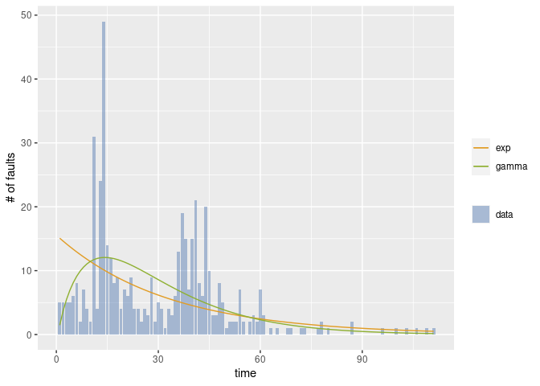
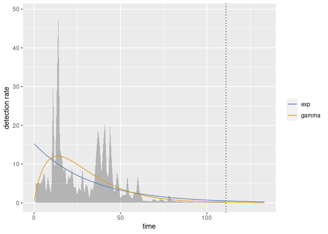
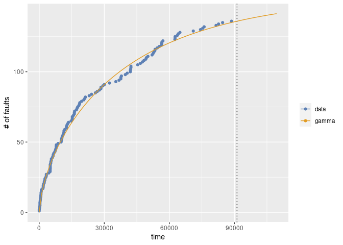
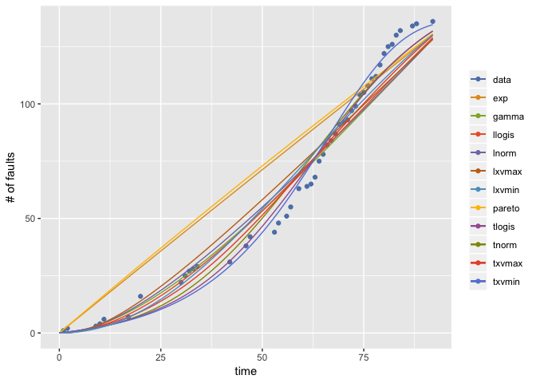

<!-- README.md is generated from README.Rmd. Please edit that file -->

# Rsrat

Rsrat provides the package to evalute the software reliability from the
fault data collected in the testing phase. Rsrat can use two types of
data; fault-detection time data and its grouped data. The
fault-detection time data is a sequence of time intervals of fault
detection times (CPU time, etc). Also its grouped data is a sequence of
the number of detected faults for each time interval (per a working day,
per a week, etc). The reliability evaluation is based on the software
reliability growth model with NHPP (non-homogeneous Poisson process).

## Installation

You can install Rsrat from GitHub with:

``` r
install.packages("devtools")
devtools::install_github("SwReliab/Rsrat")
```

Alternatively, you can use Remote to install Rsrat from GitHub

``` r
install.packages("remotes")
remotes::install_github("SwReliab/Rsrat")
```

## Example

This is an example of the estimation of software reliability growth
models from a fault data (tohma).

``` r
### load library
library(Rsrat)

### load example data
data(dacs)

### tohma is a grouped data
tohma
#>   [1]  5  5  5  5  6  8  2  7  4  2 31  4 24 49 14 12  8  9  4  7  6  9  4  4  2
#>  [26]  4  3  9  2  5  4  1  4  3  6 13 19 15  7 15 21  8  6 20 10  3  3  8  5  1
#>  [51]  2  2  2  7  2  0  2  3  2  7  3  0  1  0  1  0  0  1  1  0  0  1  1  0  0
#>  [76]  0  1  2  0  1  0  0  0  0  0  0  2  0  0  0  0  0  0  0  0  1  0  0  0  1
#> [101]  0  0  1  0  0  1  0  0  1  0  1

### Esimate all models and select the best one in terms of AIC
(result <- fit.srm.nhpp(fault=tohma))
#> Model name: lxvmin
#>    omega    loclog  scalelog  
#> 481.7029   -3.4642    0.6637  
#> Maximum LLF: -316.2599 
#> AIC: 638.5198 
#> Convergence: TRUE

### Draw the graph 
mvfplot(fault=tohma, srms=result)
```


``` r
rateplot(fault=tohma, srms=result)
```



The second example illustrates the estimation for two specified models.

``` r
### All models in the package
srm.models
#>  [1] "exp"    "gamma"  "pareto" "tnorm"  "lnorm"  "tlogis" "llogis" "txvmax"
#>  [9] "lxvmax" "txvmin" "lxvmin"

### Estimate two models and no select
(result <- fit.srm.nhpp(fault=tohma, srm.names=c("exp", "gamma"), selection=NULL))
#> $exp
#> Model name: exp
#>    omega      rate  
#> 497.2912    0.0308  
#> Maximum LLF: -359.8777 
#> AIC: 723.7555 
#> Convergence: TRUE 
#> 
#> 
#> $gamma
#> Model name: gamma
#>     omega      shape       rate  
#> 483.52301    1.88475    0.06447  
#> Maximum LLF: -319.5695 
#> AIC: 645.139 
#> Convergence: TRUE

### Draw the graph
mvfplot(fault=tohma, srms=result)
```


``` r
### Draw the graph (dmvf)
dmvfplot(fault=tohma, srms=result)
```



``` r
rateplot(fault=tohma, srms=result)
```



The third example shows the case where the fault data are fault
detection data.

``` r
### fault-detection time data
#### Time intervals for all faults
#### The last value is a negative value, that indicates the time interval in which there is no fault detection after the last fault detection.
sys1
#>   [1]     3    30   113    81   115     9     2    91   112    15   138    50
#>  [13]    77    24   108    88   670   120    26   114   325    55   242    68
#>  [25]   422   180    10  1146   600    15    36     4     0     8   227    65
#>  [37]   176    58   457   300    97   263   452   255   197   193     6    79
#>  [49]   816  1351   148    21   233   134   357   193   236    31   369   748
#>  [61]     0   232   330   365  1222   543    10    16   529   379    44   129
#>  [73]   810   290   300   529   281   160   828  1011   445   296  1755  1064
#>  [85]  1783   860   983   707    33   868   724  2323  2930  1461   843    12
#>  [97]   261  1800   865  1435    30   143   108     0  3110  1247   943   700
#> [109]   875   245   729  1897   447   386   446   122   990   948  1082    22
#> [121]    75   482  5509   100    10  1071   371   790  6150  3321  1045   648
#> [133]  5485  1160  1864  4116 -2526

### Esimate
(result <- fit.srm.nhpp(time=sys1[sys1>=0], te=-sys1[sys1<0]))
#> Warning in emfit(srm, data, initialize = TRUE, maxiter = con$maxiter, reltol =
#> con$reltol, : Did not converge to MLE by max iteration.
#> Model name: gamma
#>     omega      shape       rate  
#> 1.545e+02  6.357e-01  1.618e-05  
#> Maximum LLF: -967.1074 
#> AIC: 1940.215 
#> Convergence: TRUE

### Draw the graph
mvfplot(time=sys1[sys1>=0], te=-sys1[sys1<0], srms=result)
```



The fourth example illustrates the case where the mvfs for all the
models are drawn.

``` r
### Esimate and return all the estimated results
(result <- fit.srm.nhpp(fault=sys1g, selection=NULL))
#> Warning in emfit(srm, data, initialize = TRUE, maxiter = con$maxiter, reltol =
#> con$reltol, : Did not converge to MLE by max iteration.

#> Warning in emfit(srm, data, initialize = TRUE, maxiter = con$maxiter, reltol =
#> con$reltol, : Did not converge to MLE by max iteration.

#> Warning in emfit(srm, data, initialize = TRUE, maxiter = con$maxiter, reltol =
#> con$reltol, : Did not converge to MLE by max iteration.

#> Warning in emfit(srm, data, initialize = TRUE, maxiter = con$maxiter, reltol =
#> con$reltol, : Did not converge to MLE by max iteration.
#> $exp
#> Model name: exp
#>     omega       rate  
#> 4.295e+03  3.347e-04  
#> Maximum LLF: -192.5611 
#> AIC: 389.1221 
#> Convergence: FALSE 
#> 
#> 
#> $gamma
#> Model name: gamma
#>     omega      shape       rate  
#> 5.400e+02  1.799e+00  8.543e-03  
#> Maximum LLF: -182.2326 
#> AIC: 370.4651 
#> Convergence: TRUE 
#> 
#> 
#> $pareto
#> Model name: pareto
#>    omega     shape     scale  
#>  1179.22     56.39  44141.81  
#> Maximum LLF: -193.7977 
#> AIC: 393.5953 
#> Convergence: FALSE 
#> 
#> 
#> $tnorm
#> Model name: tnorm
#>  omega    mean      sd  
#> 150.45   60.97   26.72  
#> Maximum LLF: -173.955 
#> AIC: 353.91 
#> Convergence: TRUE 
#> 
#> 
#> $lnorm
#> Model name: lnorm
#>    omega   meanlog     sdlog  
#> 6188.497     8.270     1.839  
#> Maximum LLF: -184.3571 
#> AIC: 374.7142 
#> Convergence: FALSE 
#> 
#> 
#> $tlogis
#> Model name: tlogis
#>    omega  location     scale  
#>   153.37     62.34     16.17  
#> Maximum LLF: -172.6565 
#> AIC: 351.313 
#> Convergence: TRUE 
#> 
#> 
#> $llogis
#> Model name: llogis
#>       omega  locationlog     scalelog  
#>    392.6774       4.9056       0.5364  
#> Maximum LLF: -181.6148 
#> AIC: 369.2296 
#> Convergence: TRUE 
#> 
#> 
#> $txvmax
#> Model name: txvmax
#>  omega     loc   scale  
#> 208.49   62.51   38.96  
#> Maximum LLF: -177.5718 
#> AIC: 361.1435 
#> Convergence: TRUE 
#> 
#> 
#> $lxvmax
#> Model name: lxvmax
#>     omega     loclog   scalelog  
#> 18401.836     11.147      4.134  
#> Maximum LLF: -186.8055 
#> AIC: 379.611 
#> Convergence: FALSE 
#> 
#> 
#> $txvmin
#> Model name: txvmin
#>  omega     loc   scale  
#> 136.81  -66.09   18.22  
#> Maximum LLF: -166.5841 
#> AIC: 339.1683 
#> Convergence: TRUE 
#> 
#> 
#> $lxvmin
#> Model name: lxvmin
#>    omega    loclog  scalelog  
#> 183.4354   -4.4188    0.4831  
#> Maximum LLF: -180.7614 
#> AIC: 367.5227 
#> Convergence: TRUE

### Draw the graph
mvfplot(fault=sys1g, srms=result)
```


